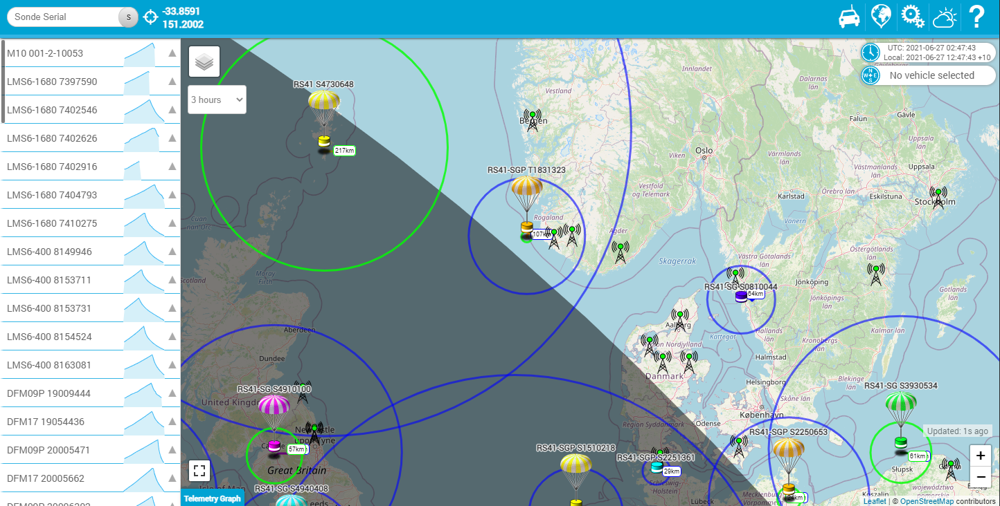

# SondeHub Tracker

A fork of [habitat-mobile-tracker](https://github.com/rossengeorgiev/habitat-mobile-tracker) for use with the [SondeHub v2 ElasticSearch](https://github.com/projecthorus/sondehub-infra/wiki/ElasticSearch-Kibana-access) database. Huge credits to [Rossen Georgiev](https://github.com/rossengeorgiev/) for developing the mobile-tracker.

A webapp for tracking radiosondes. Works an desktop and mobile devices.
The SondeHub tracker is a continuation of [spacenear.us/tracker](http://spacenear.us/tracker).

## Features

* Radiosonde Tracking using [SondeHub V2](https://github.com/projecthorus/sondehub-infra/wiki/ElasticSearch-Kibana-access) data. 
* Telemetry graph for each balloon
* Chase Car functionality
* Near realtime weather overlays
* [Daylight cycle overlay](https://github.com/rossengeorgiev/nite-overlay), for long flights
* Map tracker with Leaflet API
* Run the app natively on IOS, Android, or desktop as a Progressive Wep App

### Geo position

The app will ask for permission to use your location.
This is required for some of the features. It is **important** to note that
your location will not be made available or send to anyone. Unless, you enable
 the `chase car mode`, which will periodically upload it to SondeHub. _The app
will always start with `chase car mode` disabled._

## Browser requirements

Any modern browser should be able to run the app. Some features are limited to Chromium based browsers.

## Contribute

Don't hesitate to report any issues, or suggest improvements. Just visit the [issues page](https://github.com/projecthorus/sondehub-tracker/issues).
Pull requests are welcome.

## Installation

Requirements: Java

    $ git clone https://github.com/projecthorus/sondehub-tracker.git
    $ ./build.sh

## Original design

Author: Daniel Saul [@danielsaul](https://github.com/danielsaul)

